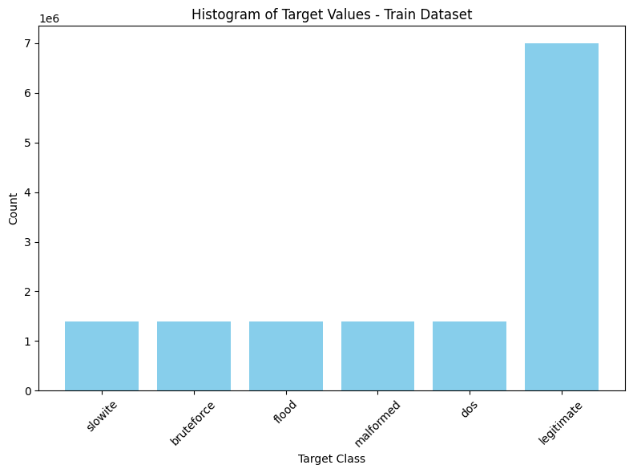
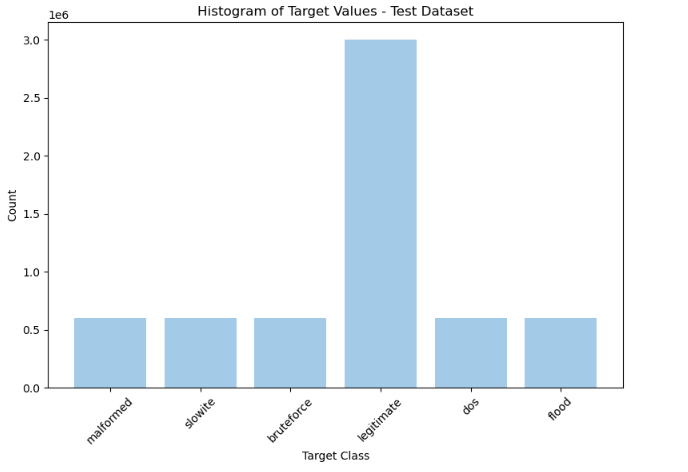
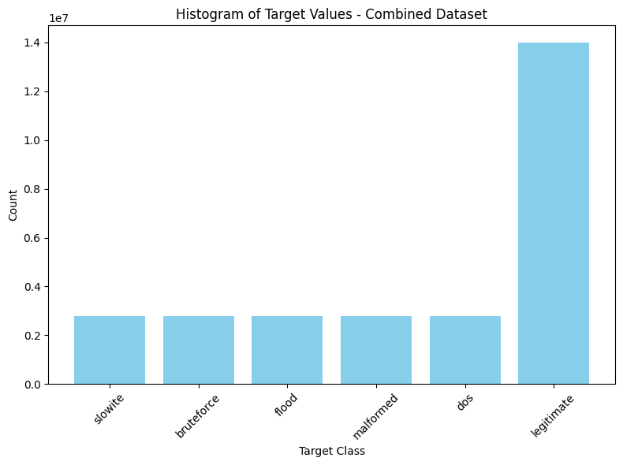

## **Description of the features in the dataset:** 

tcp.flags (text): Represents the TCP flags used in the communication. TCP flags indicate control information such as connection establishment, termination, and other states of the TCP connection.

tcp.time_delta (double precision): The time difference between consecutive TCP packets. This helps in understanding the timing characteristics of the network traffic.

tcp.len (integer): The length of the TCP packet in bytes, indicating the size of the payload being transmitted.

mqtt.conack.flags (text): MQTT connection acknowledgment flags, which signify the status of the connection being established between the client and broker.

mqtt.conack.flags.reserved (double precision): Reserved flags in the MQTT connection acknowledgment, typically for future use or protocol extensions.

mqtt.conack.flags.sp (double precision): A specific connection acknowledgment flag used in MQTT protocol.

mqtt.conack.val (double precision): Represents the return value of the connection acknowledgment in MQTT, indicating success or failure of the connection.

mqtt.conflag.cleansess (double precision): Clean session flag in MQTT, indicating whether the broker should retain session information after a client disconnects.

mqtt.conflag.passwd (double precision): Indicates if a password is required for MQTT connection authentication.

mqtt.conflag.qos (double precision): Quality of Service (QoS) level flag, which indicates the guarantee level for message delivery in MQTT communication.

mqtt.conflag.reserved (double precision): Reserved flags in MQTT connection flags.

mqtt.conflag.retain (double precision): Retain flag, indicating whether a message should be stored by the broker for future subscribers.

mqtt.conflag.uname (double precision): Indicates whether a username is required for MQTT connection authentication.

mqtt.conflag.willflag (double precision): Will flag, which indicates whether a last will message should be sent by the broker in case of unexpected client disconnection.

mqtt.conflags (text): Aggregated MQTT connection flags.

mqtt.dupflag (double precision): Duplicate delivery flag in MQTT, indicating whether a message is a retransmission.

mqtt.hdrflags (text): Header flags associated with MQTT communication.

mqtt.kalive (double precision): Keep-alive interval in MQTT, representing the period within which the client should send a message to keep the connection alive.

mqtt.len (double precision): Length of the MQTT message in bytes.

mqtt.msg (text): The actual MQTT message being transmitted.

mqtt.msgid (double precision): MQTT message identifier, used to uniquely identify messages when QoS is greater than 0.

mqtt.msgtype (double precision): Represents the type of MQTT message, such as CONNECT, PUBLISH, SUBSCRIBE, etc.

mqtt.proto_len (double precision): Length of the MQTT protocol name field.

mqtt.protoname (text): Name of the MQTT protocol being used (e.g., "MQTT").

mqtt.qos (double precision): Quality of Service (QoS) level for the MQTT message, dictating how delivery is ensured.

mqtt.retain (double precision): Retain flag, indicating whether the MQTT broker should retain the message for future subscribers.

mqtt.sub.qos (double precision): QoS level requested during subscription to a topic.

mqtt.suback.qos (double precision): QoS level granted during subscription acknowledgment.

mqtt.ver (double precision): Version of the MQTT protocol being used.

mqtt.willmsg (double precision): Last will message content in case of client disconnection.

mqtt.willmsg_len (double precision): Length of the last will message.

mqtt.willtopic (double precision): Topic for the last will message.

mqtt.willtopic_len (double precision): Length of the last will message topic.

target (text): The label for the dataset entry, indicating whether the message is legitimate or part of an attack.

dataset_type (text): Indicates whether the row belongs to the training or testing dataset.

## **In this specific dataset, would it be better to use a NoSQL database (e.g., Neo4J) over PostgreSQL?**

NoSQL databases, such as Neo4j, are generally graph databases. They are best for datasets that have relationships between nodes that are important to the structure of the data. Compared to PostgreSQL which is used for structured data with stable relationships with well defined columns and types. 

Therefore, PostgreSQL is better for this data as it is structured and in a tabular format. One could make the arguement that a graph would be benefical as multiple attributes could be assigned to one node of edge such as all mqtt_connect_... being assigned to one edge, etc. However, since the data seems to focus more on attributes of individual messages instead of the relationships, PostgreSQL will be more beneficial storing and analyzing this kind of structured data.  

## **Histograms:**

## **Model Selection**

For spark I chose to use a Logistic Regression Model and a Random Forest Classification Model. In regards to the Logistic Regression Model, my tuneable hyperparameters where the regularization parameter and the maximum number of iterations. I chose logistic Regression for its simplicity and interpretability. It serves as a fundamental baseline model that allows us to understand the basic relationship between the input features and the target variable. Its computational efficiency also makes it suitable for large datasets. For the regularization parameter, I tested 0.01, 0.1, and 1.0 and it seems the lower regularization parameter the better as it prevents overfitting the data. Also when comparing max iterations or 1, 5, 10, the more iterations the better chance the model seems to have at converging. The best model had 0.01 regParam and 10 maxIters with and accuracy of 83%

For random forest, the hyperparamters were the number of trees and the max depth of the trees. It was chosen as its robustness and ability to handle complex, non-linear relationships in the data. It mitigates the risk of overfitting through techniques like bagging and random feature selection. Random Forests are versatile and perform well across various datasets, making it an good choice for comparison against simpler models like Logistic Regression. Testing using a subset of the data I could compare number of trees: 10, 20, 40 and max depth: 5, 10, 15. With these values it seems that. While a tree that is too deep or too many trees can over fit, it seemed that the best test accuracy came from a parameter combination of numTrees 40 and maxDepth 15. This yielded an accuracy of 68% with the subset of data. When running on cloud, due to credit constraints, I could only run the default value for random foresst which is 15 trees with a depth of 5 and obtained an accuracy of 58%.

Regardless, the logistic Regression model seemed to preform better epecially when comparing the models run on the data subset but also when run on the cloud. Although we could not run the random forest fully tuned model on cloud, the accuracy of the logistic regression model of 83% seems to be pretty high. 

For PyTorch, I used a shallow and deep neural network. The shallow network was chosen as a baseline model since it has a simplier architecture consisting of one input layer, two hidden layers with 20 neurons and one output layer. This is computationally efficent and should be faster to train. The hyperparameters are learning rate (0.01 and 0.001), number of epochs (10, 20) and batch size (32, 64). Higher learning rate allows models to converge faster but also might cause instability and cause the model to overshoot weight values. Lower rates means more stable and graduate convergence but takes longer to converge. More epochs means the model should be able to improve more over seeing the data more times but it might also lead to overfitting. Smaller batch sizes allows more weight updates per epoch but would increase training time. Larger batch size means less weight updates per epcoh but faster training time. Training on cloud, we see that the best model with a shallow network has an accuracy of around 60% with a learning rate of 0.001, 20 epochs, and a batch size of 32. 

The deep network has 4 hidden layers with 64, 64, 32, 16 neurons. This should allow the model to learn high dimensional feature representations which could help capture more complex relationships. However, it does have higher computational costs. The hyperparameters are learning rate (0.01 and 0.001), number of epochs (10, 20) and batch size (32, 64). Higher learning rate allows models to converge faster but also might cause instability and cause the model to overshoot weight values. Lower rates means more stable and graduate convergence but takes longer to converge. More epochs means the model should be able to improve more over seeing the data more times but it might also lead to overfitting. Smaller batch sizes allows more weight updates per epoch but would increase training time. Larger batch size means less weight updates per epcoh but faster training time. After training the best model with a test accuracy of 61.7% has a learning rate of 0.001, 20 epochs and a batch size of 32. This is identical to the shallow network with only a marginally better accuracy. I would expect the neural networks to have higher accuracy values but I do not train on too many epochs and do not try and tune the depth or width of either model 

## **Instrctions to run code**

### **Task 1**

1) Run the first block of code according to if you are on cloud or on a local machine. This will create the spark session
2) Run the block will file paths to load the data. Might need to change this depending on your path
3) Run the black that adds teh dataset_type with the values "train" and "test"
4) Run the block that creates the new column names

### **Task 2**

1) Run the import functions for things like col, avg, dense_rank, plt etc.
2) Run calc_avg_message_length function, analyze_target_values function, most_freq_tcp_flags function, show_histogram function
3) Run the four next blocks to get the information output desired. Make sure to be aware if the code asks for an input value

### **Task 3**

1) Run the pipeline code. This block will have get_preprocessed_pipeline, the different column vectors such as binary_cols, nominal_cols, continuous_cols and classes like FeatureTypeCaster, ColumnDropper, and OutcomeCreater
2) Since I took care of the outlier preprocessing, not just run the pipeline call code. This black should call get_preprocessed_pipeline, fit it and transform it
3) Run the code that "cache's" it
4) Run the block that preforms class weighing. At the end of this you could run the subsequential code black which should print count. THis should be lower then the 14,000,000 train data values we had at the beginnning
5) Run the code black with the spark logistic Regression model for that to train the model on the train data and then evaluate it on the test data. 
6) Run the code black with the spark Random Forest model for that to train the model on the train data and then evaluate it on the test data. 
7) Run the block that transforms the data into tensor for torch models. This should break the train data into validate and train sets and had a MyDataSet class. 
8) Run the code block with the shallow and deep neural network models
9) Run the code with the train_model function
10) Run the code with the evaluate_model function
11) Now run the block that tests over differnet hyperparameters for the shallowMLP
12) Finally, run the block that tests over differnet hyperparameters for the DeepMLP

Video walk through: https://youtu.be/-jKPyr4A4sI
